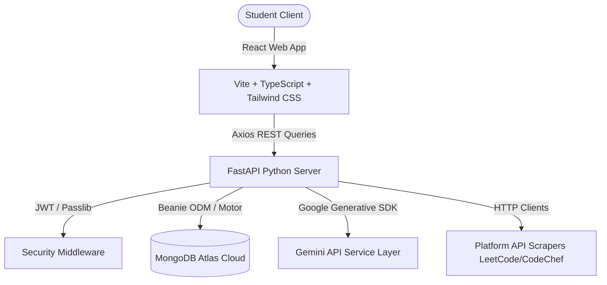

# CodePilot AI 🧭

CodePilot AI is a production-ready, full-stack AI-powered productivity system, habit scheduler, coding progress tracker, and placement preparation assistant designed specifically for computer science students and aspiring software engineers.

It features an intelligent AI coach that helps users automate study schedules, optimize task management, monitor coding streaking (LeetCode/CodeChef/HackerRank handles), track core computer science subjects (DBMS/OS/CN/OOP), and detect academic burnout early.

---

## 🏗️ Architecture Design



---

## 🗄️ MongoDB Schema Design

The application utilizes **15 collections** managed asynchronously via **Beanie ODM**:

1. **`users`**: User records, credentials, and settings.
2. **`tasks`**: User task documents, priority levels, categories, and due dates.
3. **`habits`**: Configured daily developer habits.
4. **`habit_logs`**: Check-in events tracking completion of habits on YYYY-MM-DD.
5. **`goals`**: Active high-level placement milestones.
6. **`schedules`**: Timetable slots mapping hours to study categories.
7. **`calendar_events`**: Aggregated calendar entries (merging custom logs & tasks).
8. **`pomodoro_sessions`**: Focus stopwatch logs tracking total minutes completed.
9. **`coding_progress`**: Problems solved on LeetCode/CodeChef/HackerRank, DSA checkmarks, and project completeness sliders.
10. **`study_roadmaps`**: AI-generated Daily/Weekly/Monthly learning tables.
11. **`ai_recommendations`**: Coach feedback logs, burnout flags, and warnings.
12. **`daily_reflections`**: Daily journal logs containing answers to reflection prompts.
13. **`notifications`**: Activity reminders and priority rescheduling alerts.
14. **`analytics`**: Daily aggregated metric records for charting.
15. **`placement_scores`**: Placement readiness levels and evaluation metrics.

---

## 🔌 API Route Map

All endpoints prefix with `/api` and require a JWT token in authorization headers (except register/login/forgot-password).

### Authentication Router (`/api/auth`)
* `POST /register`: Registers new user and boots blank coding profile.
* `POST /login`: Decodes password, returns JWT token.
* `GET /me`: Returns profile of authenticated user.
* `PUT /profile`: Updates branch, graduation year, target hours, etc.
* `POST /forgot-password`: Simulates sending password recovery emails.
* `POST /google`: Decodes Google credential tokens and logs/registers user.

### Tasks Router (`/api/tasks`)
* `POST /`: Creates task & creates calendar entry.
* `GET /`: Lists, searches, and filters tasks (sorted by due_date or priority).
* `PUT /{id}`: Toggles tasks completion or updates parameters.
* `DELETE /{id}`: Deletes tasks & updates calendar events.
* `POST /reschedule`: Runs the AI Task Rescheduler to move overdue tasks to today and update priority.

### Habits Router (`/api/habits`)
* `POST /`: Creates a habit.
* `GET /`: Lists active user habits and streaks.
* `POST /{id}/check`: Toggles check-in on a date string `YYYY-MM-DD`.
* `GET /heatmap`: Returns day-by-day counts for contribution graphs.
* `DELETE /{id}`: Deletes habit and history.

### Pomodoro Router (`/api/pomodoro`)
* `POST /`: Logs focus intervals.
* `GET /`: Returns focus statistics and recent history logs.

### Coding & Prep Router (`/api/coding`)
* `GET /progress`: Fetch handles, DSA topics, Core subject completion ratios, and Projects.
* `PUT /usernames`: Configures LeetCode/CodeChef handles.
* `POST /sync`: Pulls statistics from external handles.
* `POST /dsa`: Checks/unchecks DSA topics (e.g. Arrays, Recursion).
* `POST /core-subjects`: Updates progress sliders on DBMS, OS, CN, OOP.
* `POST /aptitude`: Updates sliders on Quant/Logical/Verbal.
* `POST /project`: Saves details and sliders of portfolio projects.
* `POST /career-state`: Saves resume status and mock interview performance.

### AI Study Planner Router (`/api/study-planner`)
* `POST /`: Feeds topics and target roles to Gemini to return plans.
* `GET /current`: Returns current generated roadmaps.

### AI Coach Router (`/api/coach`)
* `GET /diagnostic`: Runs AI analysis on today's logs to return productivity scores, tips, and burnout indices.

### AI Reflections Router (`/api/reflections`)
* `POST /`: Submits daily journal inputs, triggers AI syntheses, and saves summaries.
* `GET /history`: Lists past reflection entries.

### Placement Router (`/api/placement`)
* `GET /readiness`: Returns dynamically computed career scores and improvement plans.

### Notifications Router (`/api/notifications`)
* `GET /`: Returns system alerts.
* `PUT /{id}/read`: Flags single alerts as read.
* `PUT /read-all`: Flags all alerts as read.

### Analytics Router (`/api/analytics`)
* `GET /`: Pulls daily scores for the past 7 days to draw AreaCharts.

---

## 🛠️ Local Installation & Launch

### Prerequisites
* **Python 3.10+** installed
* **Node.js 18+** installed
* **MongoDB** (local connection or MongoDB Atlas URI string)

### 1. Launch Backend API
1. Navigate to the backend directory:
   ```bash
   cd backend
   ```
2. Setup virtual environment:
   ```bash
   python -m venv venv
   source venv/Scripts/activate  # On Windows
   ```
3. Install dependencies:
   ```bash
   pip install -r requirements.txt
   ```
4. Create a `.env` file using the template:
   ```bash
   cp .env.example .env
   ```
   *Modify `GEMINI_API_KEY` and `MONGODB_URI` parameters as needed.*
5. Run the FastAPI dev server:
   ```bash
   python -m uvicorn app.main:app --reload --port 8000
   ```

### 2. Launch Frontend Client
1. Navigate to the frontend directory:
   ```bash
   cd frontend
   ```
2. Install node dependencies:
   ```bash
   npm install
   ```
3. Boot Vite local development server:
   ```bash
   npm run dev
   ```
4. Open the browser at [http://localhost:5173](http://localhost:5173).

---

## 🚀 Production Deployment

### Backend (Render Deployment)
1. Commit the `backend/` folder to GitHub.
2. Link the repository to your Render.com dashboard.
3. Configure a **Web Service**:
   * **Runtime**: Python
   * **Build Command**: `pip install -r requirements.txt`
   * **Start Command**: `uvicorn app.main:app --host 0.0.0.0 --port $PORT`
4. Add environment variables:
   * `MONGODB_URI`: (Your Atlas connection URI)
   * `JWT_SECRET`: (Random key for tokens)
   * `GEMINI_API_KEY`: (Google Gemini API Token)

### Frontend (Vercel Deployment)
1. Commit the `frontend/` folder to GitHub.
2. Connect the repository to your Vercel dashboard.
3. Vercel detects Vite settings automatically. Configure the **Build Settings**:
   * **Framework Preset**: Vite
   * **Build Command**: `npm run build`
   * **Output Directory**: `dist`
4. Add environment variables:
   * `VITE_API_URL`: (Link to your Render backend domain, e.g. `https://codepilot-backend.onrender.com`)
