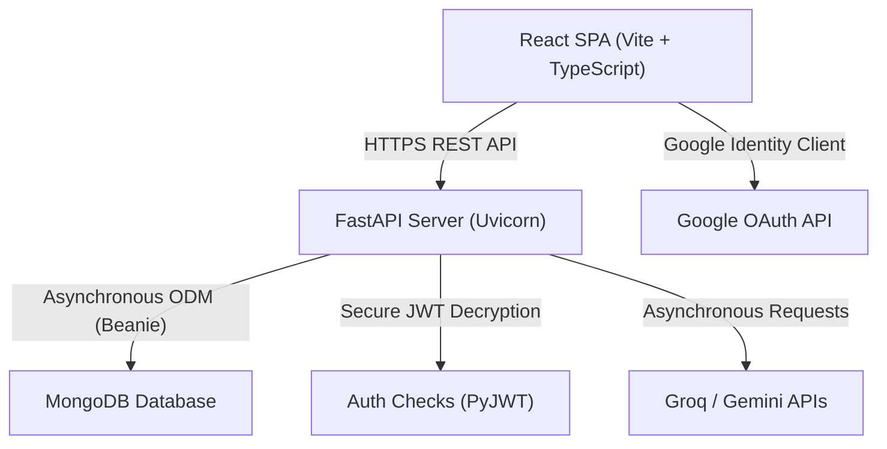

# Interview Preparation & Technical Guide
## Placement Tracker & Productivity Planner (CodePilot AI)

This guide provides a comprehensive overview of the technology stack, architecture, modular implementation, benefits, and anticipated interview questions with answers for your project. Use this to prepare for your interviews.

---

## 1. System Architecture Overview
The application follows a modern **decoupled client-server architecture**:
*   **Frontend**: A Single Page Application (SPA) built with **React**, **TypeScript**, and **Vite** for fast, optimized hot-reloads and production builds. State management is handled globally by **Zustand**. Styling uses **Tailwind CSS**.
*   **Backend**: An asynchronous **FastAPI** server (Python 3.11) built for high-performance API routing and fast document parsing.
*   **Database**: **MongoDB** (NoSQL), interface-mapped using **Beanie ODM** (Object-Document Mapper), which utilizes asynchronous Pydantic validation structures.

---

## 2. Technology Stack Breakdown

| Technology | Purpose in Project | Module / Page Location | Business & Developer Benefits |
| :--- | :--- | :--- | :--- |
| **React (v18)** | Client-side component UI framework, rendering UI declaratively and updating on state change. | Entire Frontend Client (`frontend/src`) | Virtual DOM updates provide responsive interactions; reusable components speed up development. |
| **TypeScript** | Static typing overlay for JavaScript, catching bugs at compile-time and enforcing strict data structures. | Entire Frontend Client (`.ts`, `.tsx` files) | Eliminates runtime errors, provides rich IDE autocomplete, and enforces schema compliance with backend models. |
| **Vite** | Frontend build system and bundler. | Project Root / Bundler configuration | Hot Module Replacement (HMR) allows sub-second local updates; builds optimized minified assets. |
| **FastAPI** | High-performance Python backend framework. | Entire Backend Service (`backend/app`) | Asynchronous request handling via `async/await`; automatic OpenAPI documentation `/docs`; native integration with Pydantic. |
| **MongoDB & Beanie ODM** | Asynchronous, schema-enforced NoSQL document store. | Database config (`app/config/db.py`) and Backend Models (`app/models`) | Document storage matches JSON structure of APIs; Beanie enforces strict schemas using Python Pydantic classes. |
| **Zustand** | Lightweight, global state management library for React. | Auth store (`frontend/src/store/authStore.ts`) | Simple boilerplate compared to Redux; easy persistent storage; provides reactivity across independent sidebar, header, and profile components. |
| **Tailwind CSS** | Utility-first CSS framework. | App styling (`frontend/src/index.css`) | Fast, cohesive styling; simplifies dark mode toggling; eliminates heavy stylesheet code bloating. |
| **Google Identity Services & `google-auth`** | Secure browser-native OAuth 2.0 single sign-on (SSO). | Login/Register (`Auth.tsx`) and Backend authentication router (`auth.py`) | Restricts spoofing; secure verification using ID token signatures directly with Google's certs; seamless user onboarding. |
| **Recharts** | Interactive, responsive charting library. | Admin Dashboard (`Admin.tsx`) and Leaderboard podium / stats | Beautiful, customizable data visualization; scales smoothly; fits the app's premium dark mode aesthetics. |
| **PyPDF & FastAPI Upload** | Parsing resume documents and extracting text contents. | Resume upload (`Prep.tsx`) and backend API endpoint (`placement.py`) | Allows instant ATS checking on client resume files without loading heavy external document parsing tools. |
| **Gemini & Groq APIs** | Generating study plans, AI coach advice, mock interview questions, and resume ATS score/suggestions. | AI Planner (`study_planner.py`), Prep Coach (`coach.py`), and Resume Analyzer (`placement.py`) | Offloads complex NLP and text generation; yields customizable roadmap outlines and diagnostic interview reports instantly. |

---

## 3. Modular Implementation Details

### A. Authentication & User Session Module
*   **How it works**: Uses a hybrid approach. Users can sign in traditionally (Email/Password verified via `bcrypt` hashing) or use **Native Google OAuth**. 
*   **Google OAuth Flow**: The frontend initializes the Google Identity Services script. Clicking the native button opens a browser dialog to let the user select their active Google Account. Google returns a signed ID token (JWT) to the React callback, which is posted to `/api/auth/google`. The backend verifies the token signature using the Google Client ID and extracts their email, name, and profile picture.
*   **Session Management**: A FastAPI middleware/dependency extracts the bearer JWT (JSON Web Token) from the headers, verifies it using `pyjwt`, and injects the authenticated `User` model into endpoints via FastAPI Dependency Injection (`Depends(get_current_user)`).

### B. Placement Preparation & ATS Analyzer Module
*   **How it works**: In the Placement Prep Hub, users upload a PDF resume. The frontend sends it via multipart/form-data. The backend reads it using `PyPDF` to extract clean text.
*   **AI Assessment**: This text is bundled into a tailored system prompt and sent to the LLM (Gemini/Groq). The LLM analyzes the text against core placement metrics: technical skill density, formatting, projects, and impact. It returns a structured JSON payload containing an ATS score, strengths list, and actionable improvements.
*   **DB Persistence**: The results are saved under `PlacementScore` document and synced to update the user's "Placement Readiness Score" dynamically.

### C. Gamified Weekly Leaderboard
*   **Aggregation Logic**: In `leaderboard.py`, the backend runs an aggregation query. For each user:
    1. It fetches coding progress logs and sums problems solved in the last 7 days (`daily_solved_count` offsets).
    2. It fetches Pomodoro focus sessions and calculates total focus hours completed in the last 7 days.
    3. **Score Formula**: `Score = (Problems Solved * 10) + (Focus Hours * 5)`.
    4. Ranks are assigned dynamically by sorting scores descending.
*   **Podium Layout**: The frontend renders the top 3 users on a visual podium (Gold, Silver, Bronze cards) showcasing their Google avatars/custom photos.

### D. Admin Control Panel Dashboard
*   **Historical Aggregation**: The backend `/stats` route queries user, task, Pomodoro, chat, and AI request collections. It groups activity logs by date for the last 7 days.
*   **Visualization**: Renders two charts via `recharts`:
    1. **User Growth & Engagement (AreaChart)**: Plots registrations and active users over time with premium gradient color fills.
    2. **AI & Messaging Activity (BarChart)**: Stacked bar chart showing daily AI requests, chat messages, and study plans to gauge layout activity.

---

## 4. Potential Interview Questions & Answers

### Q1: Why did you choose FastAPI over Flask or Django?
*   **Answer**: "FastAPI is built natively on top of Starlette and Pydantic, making it one of the fastest Python frameworks available. Its primary advantage is native support for asynchronous programming (`async/await`), which is crucial for a project like ours that performs multiple parallel external calls (MongoDB queries, Groq/Gemini API requests). Additionally, FastAPI automatically validates incoming request payloads against Pydantic schemas and generates interactive, self-documenting Swagger UI endpoints out of the box."

### Q2: Why did you choose MongoDB instead of a relational database like PostgreSQL?
*   **Answer**: "Our data is highly document-centric and flexible. For example, user progress logs, custom study plans, checklist questions, and AI-generated roadmaps do not fit cleanly into strict relational tables without excessive joins. In MongoDB, these are stored as documents matching our frontend JSON structures exactly. Furthermore, using MongoDB allows us to embed document sub-structures (such as progress dictionaries or lists of project milestones) directly inside the user progress documents, improving read performance by avoiding complex table relational lookups."

### Q3: What is Beanie ODM, and why did you use it instead of PyMongo or Motor?
*   **Answer**: "Beanie is an asynchronous ODM (Object-Document Mapper) for MongoDB that integrates directly with Pydantic. Instead of writing raw dictionaries with PyMongo/Motor and manually validating data, Beanie maps MongoDB collections to Pydantic classes. This means every document read or written is automatically validated against our schema. It also simplifies operations (e.g. `User.find_one(User.email == email)`) and manages migrations, database initialization, and relation mapping in a clean, typed manner."

### Q4: How is security handled for Google OAuth login?
*   **Answer**: "We implement secure, browser-native token verification. The frontend uses Google Identity Services to get a signed JWT (credential) from Google. We send this credential to our backend. The backend uses Google's official `google-auth-library` (`id_token.verify_oauth2_token`) to verify the token signature, check the issuer (`accounts.google.com`), and verify the audience (matching our `GOOGLE_CLIENT_ID`). This prevents spoofing because the server cryptographically validates the token directly against Google's public certificates. Once verified, the backend creates a custom internal JWT access token for the user session."

### Q5: How did you implement custom profile picture uploads, and how do you store them persistently without local disk access?
*   **Answer**: "To make the application serverless-friendly and avoid problems with ephemeral local filesystems (like on Render), we convert uploaded images to **base64 Data URLs** on the frontend using `FileReader` after validating that the image is under 2MB. This base64 string is sent via our profile update API and saved directly in MongoDB as a string under the user's `avatar` field. This guarantees 100% persistence across server restarts without requiring a local static files folder or an S3 bucket configuration. The frontend layouts then check if the avatar string starts with `data:image/` or `http` to render it in an `` tag."

### Q6: Can you explain the Weekly Leaderboard logic? How does the scoring work, and is it performant?
*   **Answer**: "The leaderboard score formula is `Score = (Problems Solved * 10) + (Focus Hours * 5)`. 
    To calculate this, the backend queries MongoDB:
    1. It fetches coding progress documents and filters problems solved over the last 7 days using date strings inside `daily_solved_count`.
    2. It queries Pomodoro session history completed in the last 7 days, sums duration minutes, and converts to hours.
    3. It aggregates these into a list, sorts them in descending order by score, and assigns ranks.
    To scale this, in production, we could cache this leaderboard query result using Redis or a local memory cache refreshed by a background cron scheduler every 10–15 minutes, rather than recalculating it on every single user request."

### Q7: How did you implement dark mode, and how is it persisted?
*   **Answer**: "We manage dark mode using Tailwind CSS and a global state store (Zustand). Tailwind is configured to toggle dark mode using the `class` strategy. The theme state is managed by `themeStore.ts`. On startup, it checks the browser's `localStorage` for a saved preference (or falls back to the system preference). It then toggles the `dark` class on the HTML `document.documentElement` element, which propagates Tailwind's `dark:` classes across all UI elements instantaneously. It also persists the selected setting to `localStorage` so the user's choice is remembered."

### Q8: If the Gemini/Groq APIs fail or hit rate limits, how does the app handle it?
*   **Answer**: "We handle LLM errors gracefully. In our API routes, we wrap AI generation calls in `try/except` blocks. If an API call fails or times out, the backend returns a clean, user-friendly error response (e.g. HTTP 503 Service Unavailable) explaining that the coach is briefly busy, rather than letting the server crash. In the future, we can implement a fallback rotation strategy: if a request to Groq fails, the system automatically retries the request using the Gemini API, ensuring maximum uptime."

### Q9: How do you handle cascading deletes when a student account is deleted?
*   **Answer**: "In our admin router, when an admin deletes a user, we perform cascading deletes across all linked collections. Before deleting the `User` document, we query and delete all documents in other collections associated with that user ID (including `Task`, `Habit`, `HabitLog`, `PomodoroSession`, `CodingProgress`, `StudyRoadmap`, `PlacementScore`, etc.). This keeps our MongoDB database clean and free of orphaned database documents."
